# 论文《Get To The Point: Summarization with Pointer-Generator Networks》

[TOC]

## 问题？

首先明白什么是摘要生成，摘要生成分成两种方式：抽取式摘要和抽象式摘要。其中，抽取式摘要直接从原文抽取，抽象式摘要需要生成原文本中没有的单词和短语。可以看出，抽象式摘要存在明显的OOV问题。由于抽象式摘要比较困难，先前的研究也多集中在抽取式上，但是随着seq2seq等模型框架的不断成功，抽象式摘要生成方法也开始逐渐得到研究。

论文《Get To The Point: Summarization with Pointer-Generator Networks》是2017年Google发表的，论文旨在解决抽象式摘要（abstract summary）中存在的三大痛点：

> Though these systems are promising, they exhibit undesirable behavior such as inaccurately reproducing factual details, an inability to deal with out-of-vocabulary (OOV) words, and repeating themselves (see Figure 1).

* 不正确地复制事实细节
* oov问题（out of vocabulary）
* 重复

为了解决上面的问题，论文提出了一种新颖的指针网络结构（pointer-generate network）和覆盖机制（coverage mechanism），解决了三个问题中的前两个，重复性问题还没有得到很好的解决。

## 模型？

### baseline

论文采用了传统的BiLSTM+Attention模型作为baseline，旨在说明指针网络的优势。baseline模型结构如下：

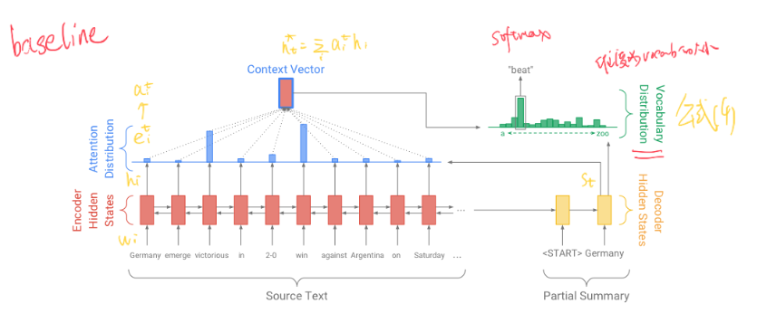

这就是一个典型的encoder-decoder模型，encoder部分采用了BiLSTM+Attention，decoder部分采用单向的LSTM。

对于encoder部分的每一个输入$w_i$，经过encoder编码后得到隐向量$h_i$，$h_i$和decoder部分每一个时刻t的隐向量$s_t$经过attention layer，获得decoder部分时刻t对于输入句子的所有attention $a_i^t$，attention score是一个标量，点乘encoder隐向量$h_i$求和后得到context vector（上下文向量），context vector 结合decoder隐向量$s_t$，产生Vocabulary Distribution，维度是vocab大小，符合sofmax分布，其中概率最大的那个为时刻t预测的word索引，也是下一时刻t+1的输入。

公式部分：

**attention**，采用的concat的方式：

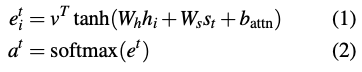

**context vector**：

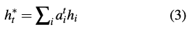

**Vocabulary distribution**：

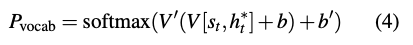

**loss：**

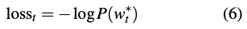

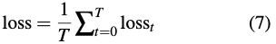

传统的sequence-to-sequence使用attention机制，模型通过注意到一些相关性比较强的词语，从而文本生成时输出原句子中不存在的新词，例如，在图中的例子中想要生成抽象式摘要"*Germany* *beat* *Argentina 2-0*"，模型应该把注意力集中在 *victorious* 和 *win* 上。但是，seq2seq模型输入的**vocabulary distribution**只能从vocabulary中根据概率抽取相应的词语，如果vocabulary中没有"2-0"这样的词语的话，模型是不可能生成我们想要的抽象式摘要的。因此需要一种方法，能够从原文本中以一定概率copy部分在vocab中并不存在的词语。这也是CopyNet网络的的一个思路(Jiatao Gu, Zhengdong Lu, Hang Li, and Victor OK Li. 2016. Incorporating copying mechanism in sequence-to-sequence learning. In *Association for Computational Linguistics*.)。

### Pointer-generator network

论文提出的Pointer-generator network在copynet的基础上进行了改进，实质也是一种copynet，顾名思义，就是能够从原文本中copy某一部分单词或短语，融合到生成的抽象式摘要中去。

模型结构：

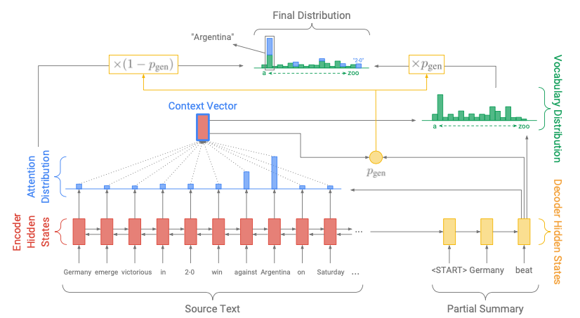

模型的encoder-deocoder和baseline保持一致，为了权衡生成（generate）和复制（copy）的比例，模型引入了$p_{gen}$这样一个参数：

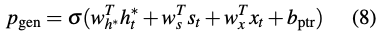

式中：$w_h^T, w_s^T, w_x^T, b_{ptr}$均是可学习参数，$h_t^*, s_t, x_t$分别是context vector，decoder部分的隐向量和输入向量。$\sigma$是sigmoid激活函数。

计算得到$p_{gen}$后，以$p_{gen}$的概率从vocabulary distribution中获得某一个word被生成的概率，图中绿色部分，以$1-p_{gen}$的概率从attention distribution中获得某一个word被copy的概率，图中蓝色的部分，最终一个word产生的概率（final distribution）就是两个概率的和：

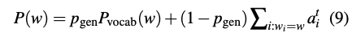

**注意到，如果vocabulary中不存在某一个单词，那么这个单词的$p_{vocab}(w)$为0；如果原文本中不存在某一个单词，那么这个单词的$\sum_{i:w_i=w}\alpha_i^t$为0.**

如图，vocabulary中没有"2-0"这样的一个单词，但是模型在生成单词的时候会考虑到它的attention score，因此也就可能被生成出来。

### Coverage mechanism

Coverage mechanism，覆盖机制（这是我的翻译），是论文提出的另外一大创新点，旨在解决重复问题（repetition）。在论文中提出的coverage model中，首先利用attention distribution计算coverage vector（当前时刻之前的attention distribution之和，每一个时刻的attention distribution都是一个向量（维度：seq_len））：

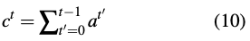

直观地，ct是源文档单词上的（非规范化）分布，表示迄今为止这些单词从注意力机制中获得的覆盖度。请注意，c0是零向量，因为在第一个时间步上，没有覆盖任何源文档。

然后，coverage vector作为额外的输入参与到当前时刻t的attention distribution的计算中，得到：

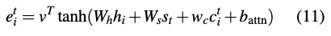

这样可以确保注意力机制的当前决定是通过提醒其先前的决定（以ct总结）来告知的。这应该使注意力机制更容易避免重复关注相同的位置，从而避免生成重复的文本。

coverage loss：

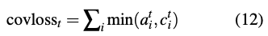

final loss：

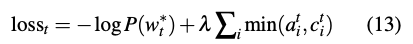

## 实验

实验结果如下表所示：

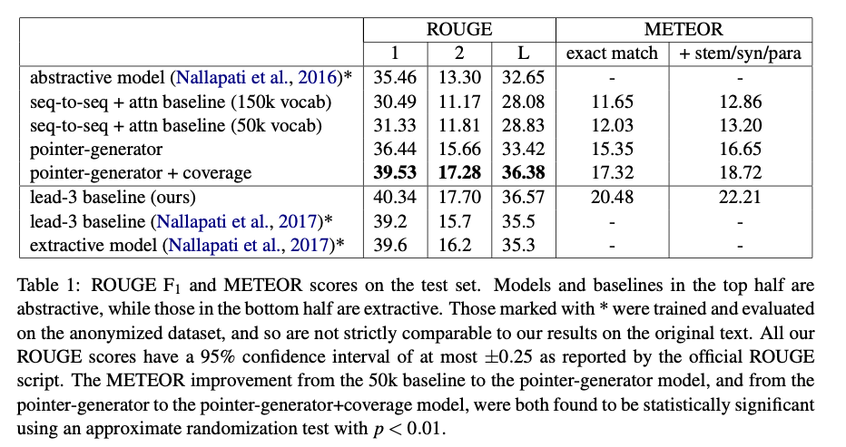

论文使用标准的ROUGE指标（Lin，2004b）评估模型，报告ROUGE-1，ROUGE-2和ROUGE-L（分别测量参考摘要和要评估的摘要之间单词重叠，双字重叠和最长公共序列）的F1分数。这里可以直接利用python库[rouge](https://pypi.org/project/rouge/)进行计算。

可以看出，论文提出的final模型在三个指标上相较baseline均取得了较大的提升。

## 总结

论文提出了两个方法：

* 一是引入指针的概念，提出指针生成网络，使得模型可以在生成新词和原文本复制中做一个平衡，这样有利于解决OOV的问题，同时也是的抽象式摘要的语法或者语义更加满足原文本；
* 而是引入coverage mechanism的概念，缓解了文本生成重复的问题

开源代码：https://github.com/abisee/pointer-generator

