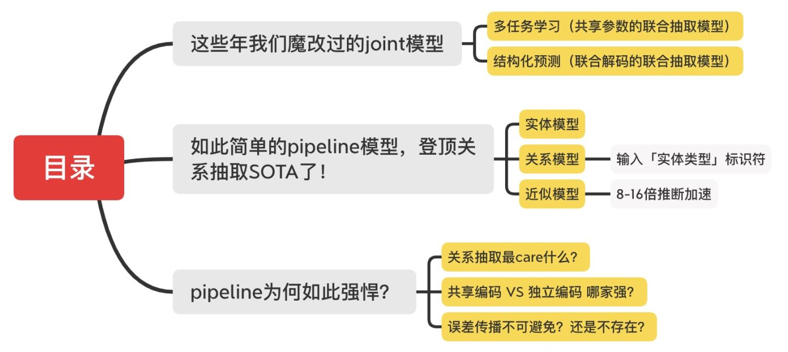
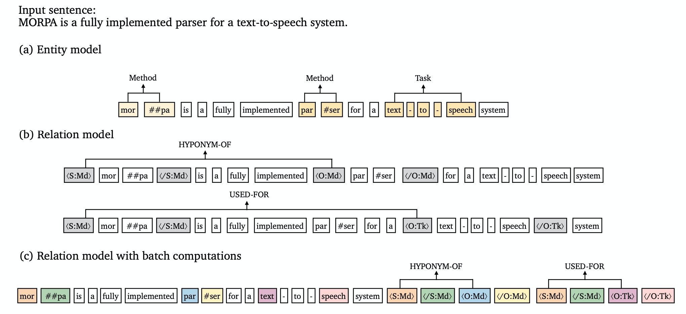
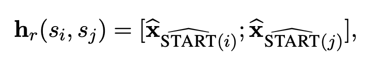
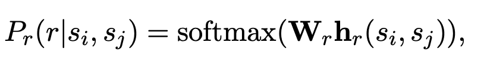
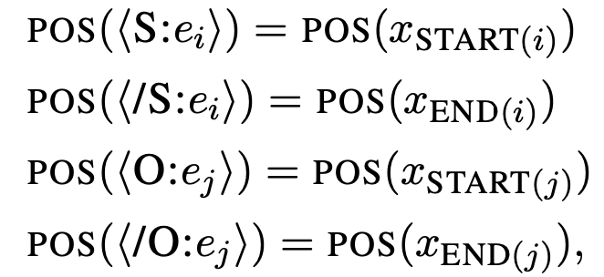
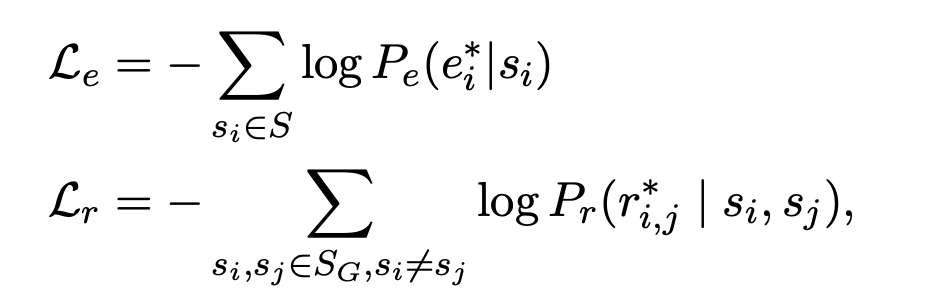
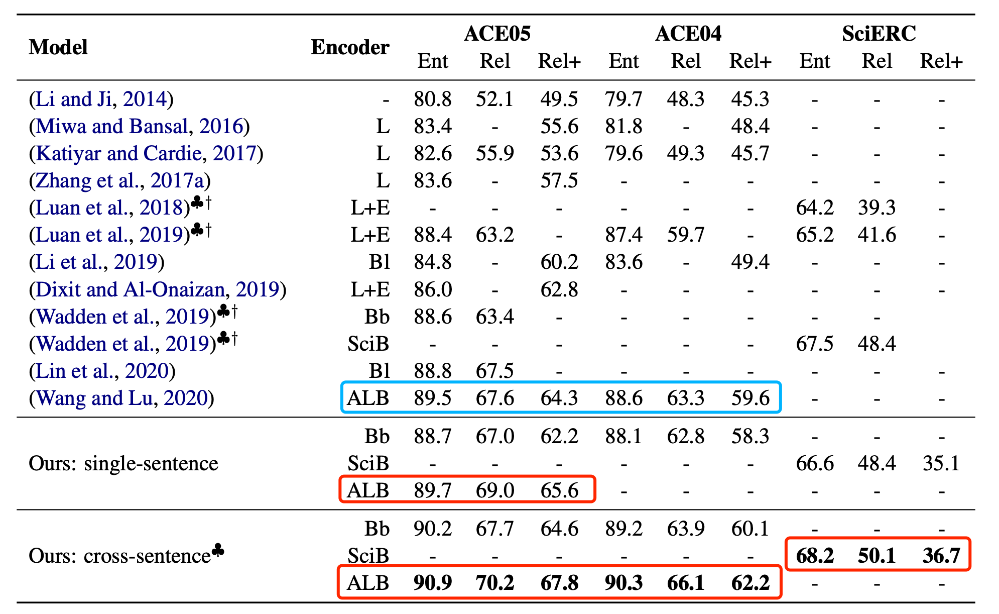
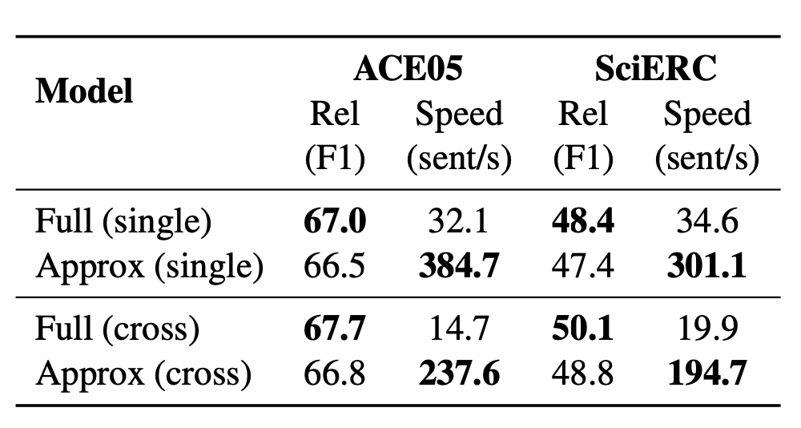
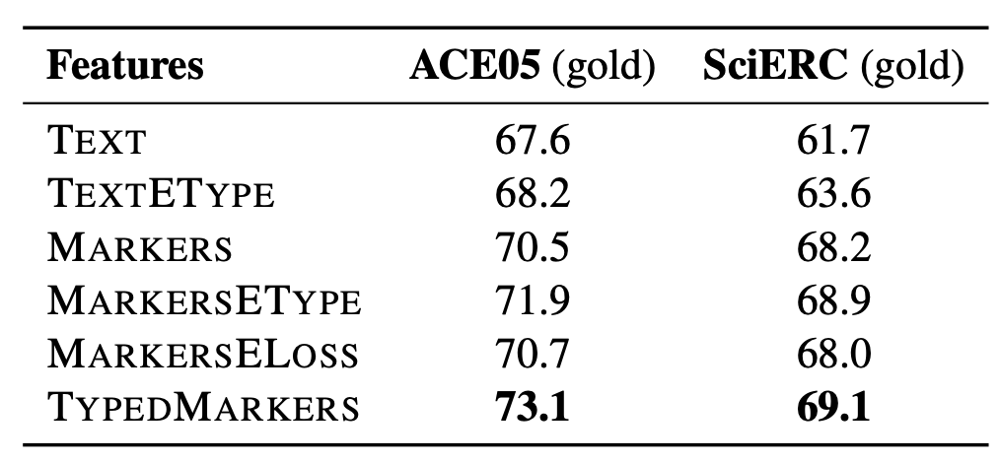
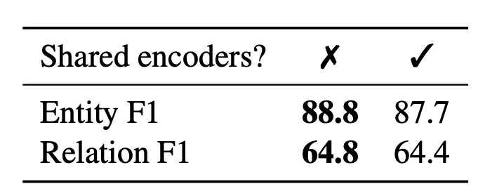

# 论文研读

论文标题：A Frustratingly Easy Approach for Joint Entity and Relation Extraction

方向：关系抽取

论文地址：https://arxiv.org/abs/2010.12812

代码地址：暂未开源

## 1. Introduce

从非结构化文本中提取实体及其关系是信息提取中的一个基本问题，这个问题可以分解为两个子任务：命名实体识别和关系提取。为了解决这一问题，目前的模型主要从两个方面出发：结构化预测*structured prediction* 和多任务学习*multi-task learning*。

这里大体了解一下实体关系抽取的两大模型：

**第1类：多任务学习**（共享参数的联合抽取模型）

多任务学习机制中，实体和关系共享同一个网络编码，但本质上仍然是采取pipeline的解码方式（故仍然存在误差传播问题）。近年来的大部分joint都采取这种共享参数的模式，集中在魔改各种**Tag框架**和**解码方式**。这里简单归纳几篇被大家熟知且容易实践的paper：

- **多头选择**[paper2]：构建N×N×C 的关系分类器对每一个实体pair进行关系预测（N为序列长度，C为关系类别总数），输入的实体pair其实是每一个抽取实体的最后一个token。后续基于多头选择机制，也有paper引入预训练语言模型和bilinear分类。
- **层叠式指针标注**[paper3]：将关系看作是SPO（Subject-Prediction-Object）抽取，先抽取主体Subject，然后对主体感知编码，最后通过层叠式的指针网络抽取关系及其对应的Object。
- **Span-level NER**[paper4]：通过片段排列抽取实体，然后提取实体对进行关系分类。

**第2类：结构化预测**（联合解码的联合抽取模型）

结构化预测则是一个全局优化问题，在推断的时候能够联合解码实体和关系（而不是像多任务学习那样，先抽取实体、再进行关系分类）。结构化预测的joint模型也有较多，比如统一的序列标注框架[paper5]、多轮QA+强化学习[paper6]等，不过有的联合解码方式通常很复杂。

## 2. How

论文所提出的方法的核心思想可以从论文展示的示例图看出，

论文所提出的模型主要由两个部分组成：实体模型和关系模型。

* 实体模型：论文所实现的实体模型是一个标准的span-based model，论文《**Entity, relation, and event extraction with contextualized span representations**》中有提及

  > 采取Span-level NER的方式，即基于片段排列的方式，提取所有可能的片段排列，通过SoftMax对每一个Span进行实体类型判断, 这样做的好处是可以解决嵌套实体问题，但计算复杂度较高，因此需要限制Span长度（对于含n个token的文本，理论上共有 ![[公式]](https://www.zhihu.com/equation?tex=+n%28n%2B1%29%2F2) 种片段排列）

  如图（a）首先使用预训练语言模型（如Bert）获得每一个token的embedding， 这里用$\bold{x}_t$表示，对于每一个span 

  $s_i \in S$，计算span representation ：
  $$
  h_e(s_i) = [x_{START}(i); x_{END}(i); φ(s_i)]
  $$
  START(i) and END(i) 分别表示每一个span的开始和结束索引。

  span representation经过softMax可以得到每一个实体的概率：
  $$
  P_e(e|s_i) = \text{softmax}(\text{W}_e\text{FFNN}(h_e(s_i))
  $$

* 关系模型：如图（b），关系模型采用span pair对（$s_i, s_j$）作为输入，然后预测这两个span之间的关系。论文的做法是在sentence中在每一对实体的前面插入marker：⟨S:e_i⟩, ⟨/S:e_i⟩, ⟨O:e_j⟩, and⟨/O:e_j⟩, e_i和e_j分别是实体的一个类型，如图中所表示的是Method和Task，这样做就把实体类型的信息引入到了上下文表示中。然后在新的sentence上concatenate两个start位置的representation，以此表示span pair的representation。

  

  同样经过softMax预测relation label

  

上述提到的两个模型（实体模型和关系模型）是采用两个独立的预训练模型进行编码，因此它们之间是不共享参数的。

对于原始关系模型来说，需要对每一个pair对进行模型计算，这样极大增加了计算开销，做法显然不可取，因此为了克服这一问题，论文作者提出了自己的改进。改进的思路是当一个sentence中存在着不同的pair对时，避免重复计算，具体办法如图（c）：

1. 首次，取代原始关系模型直接将实体标记插入到实体的首尾两端，而是直接将一句话的所有实体标记塞到句子的后面，所有实体标记和对应的实体token共享position embedding，图中同一种颜色的token共享position embedding，这样也不改变原有的位置信息，通过这种「近似模型」可以实现**一次编码文本就可以判断所有实体pair间的关系**。

2. 在attention层增加约束：

   1). 所有的text tokens只能attention到text tokens，而不能attention到marker tokens；

   2). 所有marker tokens可以获取所有的tokens的上下文信息。

经过两处修改就可以将text token和marker token独立开来，并且text token的embedding无需重复计算，这样一来也可以在一个关系模型的计算中批量处理来自同一句子的多对span，就是一次计算多个关系，经过这样的改进可以通过牺牲一点准确率，大大提高模型的计算速度。

模型的整体结果大致如上，剩下的就是一些细节或者tricks了：

* loss：实体模型和关系模型都采用CSE loss，

* Cross-sentence context（跨语句的上下文信息）

  由于跨句信息可用于帮助预测实体类型和关系（尤其是在代词性提及中），所以还通过简单方式引入了跨句信息，即文本输入的左右上下文中分别滑动(W−n)/2个words， n为sentence的文本长度， W 为固定窗口大小（默认100）。

论文的主要贡献之处：

1. 第一次在关系模型中引入了带有实体类型信息的实体标记，类型信息在理解关系的时候起着重要的作用，比如”苹果“代表水果或者公司，在理解”苹果“和其他实体的关系之前，了解”Disney“的实体类型是有帮助的。
2. 论文采用了一种近似的方法，大大提高了关系模型运行的速度；

## 3. Result

论文在三个端到端的关系抽取数据集进行评测：ACE04, ACE05, and SciERC。

* 不使用跨句信息，同一预训练模型下已经超过了最好的成绩
* 使用跨句信息在SciERC（文档级）登顶榜首

* 牺牲了一点准确率，带来了极大的性能提升

  

* 比较了不同实体标记的效果，得出结论：引入带有实体类型信息的标记，可以改善模型效果。**实体类别信息对于关系模型很重要**这一结论，在最新的EMNLP20的一篇刘知远老师团队的《**Learning from Context or Names?An Empirical Study on Neural Relation Extraction**》中也被提及和证明。

* 在一些情况下，使用共享编码反而不能学到特定的representation，实体和关系模型的输入形式不一样，使用单独的编码要优于共享编码。最近EMNLP20的一篇《**Two are Better than One:Joint Entity and Relation Extraction with Table-Sequence Encoders**》（这篇SOTA之前的SOTA）也认为：大多数joint模型都是共享同一个编码，但这种方式存在一个问题：**针对一项任务提取的特征可能与针对另一项任务提取的特征一致或冲突，从而使学习模型混乱**。于是乎，作者设计了2种不同的编码器（表格编码器和序列编码器），以在表示学习过程中互相帮助，最后通过实验表明使用2个编码器好于只使用1个编码。

## 4. Next

众所周知，pipeline不是存在「误差传播」吗？也就是说，关系模型在训练的时候，输入的是gold实体进行关系判断，这会导致训练和推断时候的差异（暴露偏差）。

那是不是在训练的时候输入预测的实体进行关系判断，会在推断时效果变好呢？于是论文采用10-way jackknifing方式（一种交叉验证）做了相关实验，发现训练时输入预测实体反而降低了F1值，毕竟这种方式会在训练的时候引入噪音啊～

采取pipeline进行推断时，如果有些gold实体在实体模型中没有被抽取出来，那么关系模型也就不会预测与该实体相关联的任何关系了。那有没有可能通过召回更多的实体，来减轻这种误差传播呢？论文也尝试召回更多的实体进行了实验，发现并没有提升F1值。

通过上述实验发现一些尝试均未显着改善性能，而论文提出的简单的pipeline却证明是一种出乎意料的有效策略～但丹琦大佬也指出：**并不认为误差传播问题不存在或无法解决，而需要探索更好的解决方案来解决此问题**。

不过，JayJay认为：pipeline存在误差传播，而那些基于共享编码的joint模型也存在误差传播啊，至于是不是真的会减轻这种误差传播也有待考证。

anyway，留给我们的一个课题就是：**误差传播怎么解决？**

参考

1. [反直觉！陈丹琦用pipeline方式刷新关系抽取SOTA](https://zhuanlan.zhihu.com/p/274938894)
2. Joint entity recognition and relation extraction as a multi-head selection problem: https://www.sciencedirect.com/science/article/abs/pii/S095741741830455X?via%3Dihub
3. A Novel Cascade Binary Tagging Framework for Relational Triple Extraction https://arxiv.org/pdf/1909.03227.pdf
4. Span-based Joint Entity and Relation Extraction with Transformer Pre-training https://arxiv.org/pdf/1909.07755.pdf
5. Joint extraction of entities and relations based on a novel tagging scheme https://arxiv.org/pdf/1706.05075.pdf
6. Entity-Relation Extraction as Multi-Turn Question Answering https://arxiv.org/pdf/1905.05529.pdf