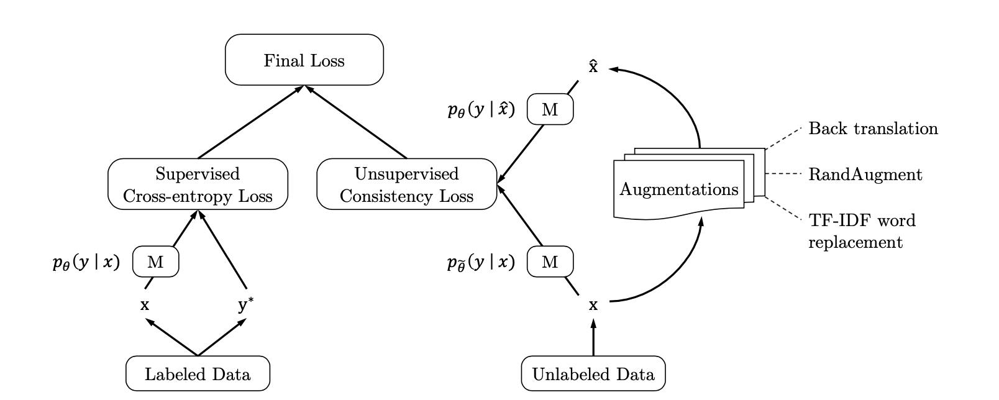
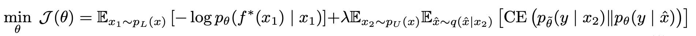
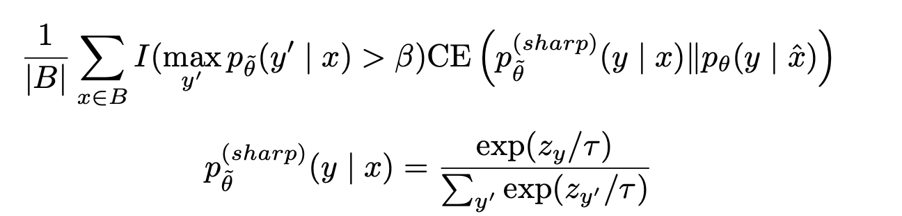

# 一致性训练：半监督数据增强

谷歌发表的半监督论文，在非常小的数据集上达到了惊人的效果，如在IMDB文本分类数据集上，仅用20条数据进行训练，达到了25000条带有标签的数据训练得到的效果，代码开源： https://github.com/google-research/uda

论文提出半监督数据增强的核心思想：一致性训练。一致性的做法就是对于无标注数据，加入噪声，但是保持标签不变。

我们的数据中，有标注数据和无标注数据，半监督学习本质上是在从无标注数据上学下一个信息和知识从而使得模型效果更好，更佳的平滑和健壮。

一般的半监督模式是这样的：

1. 输入数据为，分别计算两个东西，原本的输出分布$p_\theta(y|x)$：，输入数据注入噪声之后的输出分布$p_\theta(y|x,\varepsilon)$。
2. 最小化两个差异之间的度量$D(p_\theta(y|x)||p_\theta(y|x,\varepsilon))$:

此过程使模型对噪声不敏感，因此相对于输入（或隐藏）空间的变化更平滑。从另一个角度看，将一致性损失降至最低会逐渐将标签信息从已标记的示例传播到未标记的示例。

这其中关键的一点，或者说对模型训练结果影响巨大的一点就是如何往输入数据注入噪声或者注入什么噪声，之前的工作做法比较简单，添加高斯噪声，或者简单的数据增强。论文的做法与之前不一样，而是采用了监督学习中已经得到证实的效果较好的数据增强方法，UDA这个论文就是做了一个事情，验证监督学习中的数据增强方式放在半监督中作为一种噪声输入是有效的，是可以提升模型表现能力的。

具体做法：

其一致性loss（final loss）计算公式为：

1. 前半部分：给定输入x，假设M是需要学习的模型，$p_\theta(y|x)$表示在样本x，预测y的概率，$y^*$表示真实label ，在监督学习下计算交叉熵loss，上式的左边部分，$f^*$为最优模型。
2. 重点是后半部分，是在无标签数据上的一致性损失函数。需要注意，后半部分的参数$\hat{\theta}$是固定的，从前部分模型$\theta$直接复制过来的，简单来说就是不参与训练。式中：$\hat{x}=q(x,\varepsilon)$，$x_2$表示无标签数据

$q(\hat{x}| x)$为数据增强函数，场景不同，使用的数据增强方法也不同，具体的：

* image classification： RandAugement
* text classification：Back translation、TF-IDF word replacement

参数$\lambda$为cross-entropy loss和consistency loss的trade-off，论文中的实验大部分情况下设为1。

**训练技巧**：

* Confidence-based masking：置信度掩码

  在每个小批量中，仅对分类类别中最高概率大于阈值β的示例计算一致性损失项。将阈值β设定为较高的值。

  简单来说，一致性损失应该针对的是无标签的数据，我们在训练的时候，只是计算那些输出概率高于阈值的样本，其余样本直接抛弃掉。

* Sharpening Predictions：锐化预测（也不知道翻译的正不正确）

  已证明将预测值正规化以使其具有较低的熵是有益的，因此当使用低Softmax温度τ计算未标记示例的目标分布时，我们会提高预测值。新的一致性loss计算：

  

  参数$\tau$设为0.4。

  与Confidence-based masking联合使用

  > 如果训练的时候使用了Confidence-based masking，我们可以结合Sharpening Predictions来提升模型的表现。
  >
  > 什么是Sharpening Predictions？就是通过设定温度参数，改变最后softmax的分布，使它更加的尖锐，也就是熵更小，分布的越集中。
  >
  > 这个东西蒸馏的时候也有用到，只不过在蒸馏的时候我们需要的是扩大不同类别的相似性，温度参数是大于1比较好的。但是这里我们希望是集中输出的分布，让它的熵更小，所以温度参数应该小于1。
  >
  > 从另一个角度来说，使用了温度参数之后，阈值大于0.8 的概率应该也会提升，这就让Confidence-based masking变得没有那么难以操作。

* Domain-relevance Data Filtering：数据过滤

论文中具体的理论分析/实验证明就继续看论文

