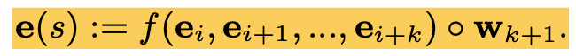
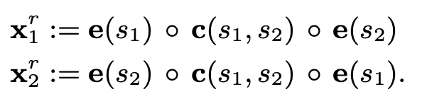
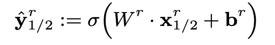

# 实体关系抽取方法

1. **基于序列标注**

   经典模型：BiLSTM+CRF

   后续：BERT+CRF

   * Lattice LSTM+CRF：[《Chinese NER Using Lattice LSTM》](https://arxiv.org/pdf/1805.02023.pdf) 

   * FLAT：[《FLAT: Chinese NER Using Flat-Lattice Transformer》](https://arxiv.org/pdf/2004.11795.pdf)，ACL2020

     *  实体抽取

     * 见《论文研读之《FLAT: Chinese NER Using Flat-Lattice Transformer》
     * 利用词典约束span
     * 采用transformer学习span representation
     * 代码开源：https://github.com/LeeSureman/Flat-Lattice-Transformer

2. **span-based**

   * [《Span-Level Model for Relation Extraction》](https://www.aclweb.org/anthology/P19-1525.pdf)，ACL2019

     * 先实体，再关系

     * 采用bilstm获取token的word embeddings

     * 对于T个token，理论上有N=T(T+1)/2个span，采用attention计算span的span representation

       

     * 为了避免span过多，进行span修剪，限制了span的最大长度（论文中max length为10）

       

     * 采用MLP+softmax预测每一个span的实体类别

     * span组成pair对，采用MLP+softmax预测每一个pai对的关系类别

     * 采用span的好处是每一个token可以属于不同的实体，这样可以解决嵌套实体问题（实体重叠）

       

       问题：

       1. 对于T个token，理论上有N=T(T+1)/2个span，对于长文本来说计算复杂度很高，并且会带来严重的样本不均衡问题（负样本过多）
       2. 关系判断时，实体冗余

   * [《Span-based Joint Entity and Relation Extraction with Transformer Pre-training》](https://arxiv.org/pdf/1909.07755.pdf)，ECAI2020

     

     * 先实体，再关系

     * 采用预训练bert模型作为core，对span进行编码，联合抽取顺序：先抽取span，对span进行实体分类，然后提取候选实体对，进行关系分类，共享编码；

     * 实体识别采用基于span-level的方式，对于输入的sentence，分词后得到token，然后组成N个span，采用fusion function（max pool）得到span embedding，然后concat width embedding和cls token得到相应的span representation，作为span classifer的input，经过softmax预测span的实体类别，如图a部分所示

       

       

       

     * span filter，过滤预测为no entity和width length>10的span，组成候选span pair对，这里我认为可以在span classifer前进行，可以降低计算量，但是可能会漏掉一些span

     * 候选span pair，concat width embedding和local context representation，作为relation classifier的input，经过softmax实现关系的判别；

       

       

     * paper的贡献之处：

       1. strong negative sample
       2. localized con- text representation

     * 代码开源：https://github.com/markus-eberts/spert

     

   * [《A General Framework for Information Extraction using Dynamic Span Graphs》](https://www.aclweb.org/anthology/N19-1308.pdf)，NAACL 2019

     * 贡献：

       1. 提出了一种信息抽取通用框架：Dynamic Graph IE（DYGIE）
       2. 联合抽取，实现实体识别/关系抽取/共指消解，不同task之间的知识共享
       3. dynamically constructed span graphs，利用全局上下文信息进行图传播，更新span representation
       4. 可以实现嵌套实体识别

     * 问题定义：

       输入：由单词序列组成的文档，根据sentence中所有可能的span生成span 集合S，span做长度限制

       输出：所有span的实体类型e，同一句子中span pair对的关系r，所有span跨句子的指代链接c

       任务划分：多任务学习，信息抽取分成命名实体识别和关系抽取两部分，增加额外的辅助task，共指消解，帮助每一个span的先行词

     * 计算：DYGIE首先枚举每个句子中的所有文本跨度span，然后计算每个跨度的局部上下文向量空间表示。然后，该模型采用动态跨度图dynamic span graph，将全局信息合并到其跨度表示中。在每个训练步骤中，模型都会识别最有可能代表实体的text span，并将这些span视为图形结构中的节点node。根据图中该节点的预测共指关系和具有关系的其他实体构造置信度加权弧。最后，利用图中具有关系的节点和共指的节点优化当前span representation。优化后的span representation具有全局的文本上下文知识，可以用来预测实体/关系类型和共指链接。

     

     * 模型：

       * **Token Representation Layer**：

         core：BiLSTM

         input：concatenate(字符表示，GLoVe词嵌入，ELMo词嵌入)，

         output：stack(前向hidden state，后向hidden state)

       * **Span Representation Layer**：

         对于每一个span，拼接得到span representation $g_i^0$ ：

         1. BiLSTM输出的$s_i$的左边和右边end points的表示
         2. 基于attention的soft "head word"
         3. width embedding

       * **Coreference Propagation Layer 共指传播层**：

         从span的初始表示$g_i^0$开始：

         1. 对于每一次迭代，计算得到一个更新向量（update vector）$u_C^t$，
         2. 利用$u_C^t$ 更新span representation：$g_i^t \rightarrow g_i^{t+1}$
         3. 重复N次，得到$g_i^N$。 

         最后的表示$g_i^N$共享了spans间的上下文关系（在共指图中是父节点/先行词的可能性）

       * **Relation Propagation Layer 关系传播层**

         共指传播层的输出$g_i^N$作为该层的输入，在每一次迭代：

         1. 计算得到一个更新向量（update vector）$u_R^t$
         2. 对于每一个span，更新g：$g_i^t \rightarrow g_i^{t+1}$
         3. 重复M次，从多个关系路径中融入关系信息到span表示中

       * **Final Prediction Layer 最终预测层**

         关系图层的输出$g_i^{N+M}$最为分类层的输入

         1. 对于实体：$g_i^{N+M}$ -> FFNN -> 预测每一个span的实体类别score
         2. 对于关系：$(g_i^{N+M}, g_j^{N+M})$ -> FFNN -> 预测（span i， span j）的关系类别score
         3. 对于共指关系：($g_i^{N}$, $g_j^{N}$) ->  预测（span i， span j）的共指关系score

     * **Dynamic Graph Construction and Span Refinement 动态图构建和span优化**

       动态的span图**通过软（soft）共指链接和关系链接，以促进更广泛的上下文传播**，从而优化span的表示。

       节点：所有的span，对于每一个span $s_i$，在第t次迭代时的表示为$g_i^t \in \R^d$

       边：共指链接和关系链接，score为边的权重

       1. **共指传播**

          * 定义一个束beam Bc，包含了bc个所有可能构成共指关系链的span。定义一个矩阵$P_C^t$保存共指置信度，size为$b_c \times K$，K是最大父节点/先行词的个数。

          * 共指图的边是单向的，由span $s_i$指向它所有可能的先行词/父节点span $s_j$，j<i

            

          *  span $s_i$和span $s_j$边的权重为$P_C^t(i,j)$:

            

            

          * 利用每条边的权重和span表示，计算得到span $s_i$的更新向量：

            

       2. **关系传播**

          * 定义关系束，$B_R$，包含$b_r$个可能具有某类关系的实体span，采用三维tensor $V_R^t \in \R^{b_R \times b_R \times L_R}$保存关系边的权重系数，$L_R$为关系类别集合

          * 每一条关系边涉及两个实体span  $s_i$和 $s_j$，边的权重$V_R^t(i,j)$是一个$L_R$维的向量，经FFNN计算得到

          * 关系更新向量：

            

            f为ReLU激活函数，目的是将所有不可能的关系score置为0，移除噪声。

       3. **更新span representation**

          

       4. **loss**

          

     * 代码开源：https://github.com/luanyi/DyGIE

   

   * [《Entity, Relation, and Event Extraction with Contextualized Span Representations》](https://www.aclweb.org/anthology/D19-1585.pdf)，EMNLP2019，google

     

     * 在DyGIE框架上的基础上集成事件抽取，形成新的DyGIE++框架

     * Token encoding：使用Bert进行token编码，滑动窗口捕获长距离依赖

     * Span enumeration：拼接span左右endpoints的token表示、width embedding

     * span graph propagation：coreference propagation、relation propagation、event propagation

       event propagation：事件触发器节点 -> 事件自变量节点

     * span representation update：

     

     * Multi-task classification：

       scoring function：two-layer，FFNN

       trigger/name entities：$\text{FFNN}_{task}(g_i)$

       relation/argument role prediction: $\text{FFNN}_{task}([g_i, g_j])$

     * 代码开源：https://github.com/dwadden/dygiepp

3. **指针网络**/**MRC（machine reading conprehensive）**

   * [《A Unified MRC Framework for Named Entity Recognition》](https://arxiv.org/pdf/1910.11476.pdf)，ACL2020

     * 代码开源：https://github.com/ShannonAI/mrc-for-flat-nested-ner
     * 实体抽取
     * 将NER问题编码成MRC问题，即产生(QUESTION, ANSWER, CONTEXT)的三元组，QUESTION的产生方式对识别结果有较大影响，因为QUESTION已经包含了label信息，需要训练两个指针网络寻找ANSWER的开始和结束索引，还要训练一个match网络预测实体类型。

     

   * [《Entity-Relation Extraction as Multi-Turn Question Answering》](https://link.zhihu.com/?target=https%3A//arxiv.org/pdf/1905.05529.pdf)
     
     * 代码开源：https://github.com/ShannonAI/Entity-Relation-As-Multi-Turn-QA
     * 先实体，再关系
     * [CLS] Q [SEP] S [SEP]

   

4. **multi-head select**

   * [Joint entity recognition and relation extraction as a multi-head selection problem ](https://www.sciencedirect.com/science/article/abs/pii/S095741741830455X?via%3Dihub)

   

