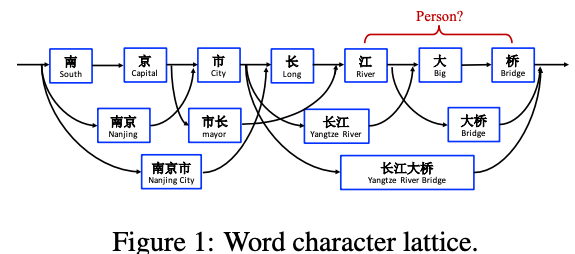

# 论文研读

论文标题：FLAT: Chinese NER Using Flat-Lattice Transformer

方向：命名实体识别

论文地址：https://arxiv.org/pdf/2004.11795.pdf

代码地址：https://github.com/LeeSureman/Flat-Lattice-Transformer

## 背景

命名实体识别研究在很多自然语言处理任务中起着不可或缺的作用，与英文NER相比，中文NER要更加困难，因为它通常涉及到词的分割，因此，中文NER通常采取基于字符的方式。究其缘由，由于中文分词存在误差，基于字符的NER系统通常好于基于词汇（经过分词）的方法。

但是基于字符的NER通常不包括词汇信息，最近的一些研究表明，词汇边界对于实体边界通常起着至关重要的作用。那么，如何引入词汇的边界信息（词汇增强）是目前中文NER研究的重点。

* **如何进行词汇增强**

从最近两年的顶会论文可以发现，目前的词汇增强方式主要分为两个流派：

1. Dynamic Architecture：设计一个动态框架，能够兼容词汇输入，模型包括Lattice LSTM、LR-CNN、CGN、LGN和本文所阅读的**FLAT**
2. Adaptive Embedding ：基于词汇信息，构建自适应Embedding，模型包括WC-LSTM等

## **FLAT**模型

*复旦大学邱锡鹏团队*在ACL2020提出了一种方法，FLAT，刷新了中文NER任务的新SOTA。FLAT模型是在Lattice LSTM的思想上发展起来的，所以首先大概了解一下Lattice LSTM模型。

### Lattice LSTM模型

**Lattice LSTM：Chinese NER Using Lattice LSTM（ACL2018）**

这篇论文基于词汇增强方法的中文NER的开篇之作，提出了一种Lattice LSTM以融合词汇信息。具体地，当我们通过词汇信息（词典）匹配一个句子时，可以获得一个类似Lattice的结构。

首先看一个例子："南京市长江大桥"，对于这句话根据不同的理解可以有不同的分词方式，当把字符和词汇结合在一起可以形成如下的lattice结构

传统的LSTM网络直接利用字符序列作为模型的输入，学习上下文知识，从文对每一个字符进行预测，这一过程并没有用到词汇的边界信息。基于Lattice结构的LSTM网络在原LSTM的基础上加入了词汇信息，具体方式如下：

* 首先获得序列的分词信息
* 如图所示，Lattice LSTM引入了一个word cell结构，对于当前的字符，融合以该字符结束的所有word信息，如图中的绿色箭头，不同的路径流入每一个字符的信息受到gated cells（门控单元）的控制。

* 可以看出，Lattice是一个有向无环图，词汇的开始和结束字符决定了其位置。对于每一个字符，Lattice LSTM采取注意力机制去融合个数可变的word cell单元，其主要的数学形式化表达为：

Lattice LSTM 的提出，将词汇信息引入，有效提升了NER性能；但其也存在一些缺点：

- **计算性能低下，不能batch并行化**。究其原因主要是每个字符之间的增加word cell（看作节点）数目不一致；
- **信息损失**：1）每个字符只能获取以它为结尾的词汇信息，对于其之前的词汇信息也没有持续记忆。如对于「药」，并无法获得‘inside’的「人和药店」信息。2）由于RNN特性，采取BiLSTM时其前向和后向的词汇信息不能共享。
- **可迁移性差**：只适配于LSTM，不具备向其他网络迁移的特性。

### FLAT：Flat-Lattice Transformer for Chinese NER

从作者对于模型的命名可以看出，FLAT模型的主要贡献主要有两点：

1. 将原有的flattice结构进行了展平，变成flat-lattice结构，无损引入词汇信息
2. 取代lstm，直接利用一层transfomer，实现了gpu并行计算，提高运行速度

#### 改进一：lattice结构展平

**问题：如何将lattice结构展平，同时又不损失词汇信息？ —> 位置编码**

在transformer中，使用全连接自注意力机制来捕获长距离文本的依赖，但是自注意力机制对于相对位置是无偏的，这一点不像BiLSTM，BiLSTM可以清楚的判断上下文知识是来自于character的左边还是右边。

受到位置向量表征的启发，FLAT设计了一种巧妙position encoding来融合Lattice 结构，具体地情况如上图所示，对于每一个字符和词汇都构建两个**head position encoding** 和**tail position encoding**，这种方式可以重构原有的Lattice结构。

也正是如此，FLAT可以直接建模字符与所有匹配的词汇信息间的交互，例如，字符[药]可以匹配词汇[人和药店]和[药店]。

至此，我们可以将Lattice结构展平，将其**从一个有向无环图展平为一个平面的Flat-Lattice Transformer结构，由多个span构成：每个字符的head和tail是相同的，每个词汇的head和tail是skipped的**。

#### 改进二：使用transformer模型加速训练

在中文NER任务中，通常在“在”这个字符后面的可能是地点或者机构等实体，对于方向性的感知会帮助单词识别其邻居是否构成一个连续的实体。BiLSTM在NER任务上取得成功的原因，关键的一点就是BiLSTM能够区分其上下文信息的方向性，来自左边还是右边。

但是对于Transformer，采用全连接自注意力机制可以捕获长距离文本依赖，但是这种依赖对于方向是无偏的，其区分上下文信息的方向性是困难的。因此，要想解决Transformer对于NER任务表现不佳的问题，必须提升Transformer的位置感知和方向感知。可见，对于「距离」和「方向性」的感知对于Transformer适用于NER任务至关重要。

论文中提到，对于lattice中的两个span xi和xj，它们之间存在三种关系：相交，包含和分离，这取决于它们的head position和tail position，论文使用稠密向量来对它们的关系建模：

然后根据这四个距离，计算得到一个相对位置的编码：

$Pd$的计算方式和普通的transformer相同。

最后，FLAT这篇论文采取XLNet论文中提出相对位置编码计算attention score：

## 结果

上图给出了论文的实验结果，具体地讲：

1. 引入词汇信息的方法，都相较于baseline模型biLSTM+CRF有较大提升。可见引入词汇信息可以有效提升中文NER性能。
2. 采用相同词表（词向量）时，FLAT好于其他词汇增强方法；
3. FLAT如果mask字符与词汇间的attention，性能下降明显，这表明FLAT有利于捕捉长距离依赖。
4. FLAT结合BERT效果会更佳。

## **总结**

近年来，针对中文NER如何更好地引入词汇信息，无论是Dynamic Architecture还是Adaptive Embedding，这些方法的出发点无外于两个关键点：

1. 如何更充分的利用词汇信息、最大程度避免词汇信息损失；
2. 如何设计更为兼容词汇的Architecture，加快推断速度；

FLAT就是对上述两个关键点的集中体现：FLAT不去设计或改变原生编码结构，设计巧妙的位置向量就融合了词汇信息，既做到了信息无损，也大大加快了推断速度。

本文介绍的词汇增强方式不仅应用于中文NER任务，也可进一步探索其在关系抽取、事件抽取中的有效性。

[论文阅读：FLAT：Chinese NER Using Flat-Lattice Transformer](https://blog.csdn.net/liu16659/article/details/108954665)

